# turbocable-server

A high-performance, standalone WebSocket gateway written in Rust, designed to handle **1M+ concurrent connections** with sub-50ms fan-out latency. Built as the core component of the [TurboCable](https://github.com/samaswin/turbocable) ecosystem.

## Why TurboCable?

WebSocket servers hit a ceiling when connections grow. Most backend frameworks
handle WebSockets in-process — each connection consumes a thread or coroutine,
memory grows linearly, and the broadcast bus becomes the bottleneck. TurboCable
solves this by moving **all WebSocket connections out of your backend** into a
dedicated Rust gateway:

```
Traditional:  1 broadcast → backend iterates N connections → N pub/sub messages → slow
TurboCable:   1 broadcast → 1 NATS publish → Rust fans out to N connections → fast
```

Your backend does O(1) work per broadcast. The Rust gateway does O(N) fan-out using
zero-copy `Bytes` cloning and lock-free `DashMap` shards — completing a fan-out
to 333k connections in under 10ms.

## Architecture



```
Backend App                  NATS JetStream                 turbocable-server
┌─────────┐   publish        ┌─────────┐   push consumer   ┌──────────────┐
│  publish("room_42", data) ─┤ TURBOCABLE│──────────────────┤  Fan-out to  │
│         │                  │  stream   │                  │  1M clients  │
└─────────┘                  └─────────┘                    └──────┬───────┘
                                                                    │
                                                            WebSocket connections
                                                            (actioncable-v1-json
                                                             or turbocable-v1-msgpack)
```

- **Your backend** publishes once to NATS and moves on — it never touches WebSocket connections.
- **NATS JetStream** persists messages and pushes them to gateway consumers.
- **turbocable-server** fans out each message to all subscribers of that stream via a lock-free DashMap registry.

See [docs/architecture.md](docs/architecture.md) for the full system design.

## Features

- **1M concurrent WebSocket connections** on a 3-node cluster (333k per node)
- **Sub-50ms p99 fan-out latency** at full scale
- **< 8 KB memory per connection**
- **JSON protocol** (`actioncable-v1-json` sub-protocol for broad client compatibility)
- **MessagePack binary protocol** (`turbocable-v1-msgpack`) for reduced bandwidth
- **RS256 JWT authentication** with hot-reloadable public keys via NATS KV
- **Stream-level authorization** — glob patterns (`chat_room_*`, `*`) in JWT claims
- **Message replay on reconnect** using JetStream sequence IDs
- **Presence tracking** via NATS KV with automatic TTL-based cleanup
- **Prometheus metrics** for connections, fan-out latency, NATS consumer lag
- **Graceful shutdown** — drains connections on SIGTERM with zero message loss
- **Per-IP connection limiting** to prevent resource exhaustion
- **SO_REUSEPORT + TCP_NODELAY** for optimal kernel-level performance
- **jemalloc** allocator on glibc Linux for predictable memory usage under high load (musl and macOS use the system allocator)

## Requirements

- Rust stable (1.88+)
- NATS Server 2.10+ with JetStream enabled

See [docs/setup.md](docs/setup.md) for detailed installation instructions.

## Quick Start

```bash
# Install Rust via asdf
asdf plugin add rust
asdf install

# Start NATS with JetStream
nats-server --jetstream &

# Build and run (without auth — for quick testing)
cargo build
RUST_LOG=info cargo run

# Verify
curl http://localhost:9292/health
# => {"status":"ok","version":"0.4.0","connections":0}
```

### Test NATS fan-out

```bash
# Terminal 1: connect a WebSocket client
wscat -c ws://localhost:9292/cable
# Receives: {"type":"welcome"}
# Send:     {"command":"subscribe","identifier":"chat_room_1"}
# Receives: {"type":"confirm_subscription","identifier":"chat_room_1"}

# Terminal 2: publish a message via NATS
nats pub TURBOCABLE.chat_room_1 '{"text":"hello from NATS!"}'
# Terminal 1 receives: {"type":"message","identifier":"chat_room_1","message":{"text":"hello from NATS!"},"seq":1}
```

See [docs/nats-jetstream.md](docs/nats-jetstream.md) for replay testing and full
NATS integration details.

### With JWT Authentication

```bash
# Generate RSA key pair
openssl genpkey -algorithm RSA -pkeyopt rsa_keygen_bits:2048 -out /tmp/tc_private.pem
openssl pkey -in /tmp/tc_private.pem -pubout -out /tmp/tc_public.pem

# Start with auth enabled
TURBOCABLE_JWT_PUBLIC_KEY_PATH=/tmp/tc_public.pem RUST_LOG=info cargo run
```

See [docs/jwt-authentication.md](docs/jwt-authentication.md) for generating test
tokens and the full testing walkthrough.

## Configuration

All options can be set via CLI flags or environment variables:

| Flag | Env Var | Default | Description |
|------|---------|---------|-------------|
| `--port` | `TURBOCABLE_PORT` | `9292` | Listen port |
| `--nats-url` | `TURBOCABLE_NATS_URL` | `nats://localhost:4222` | NATS server URL |
| `--node-id` | `TURBOCABLE_NODE_ID` | `node_<uuid>` | Unique node identifier |
| `--ping-interval-secs` | `TURBOCABLE_PING_INTERVAL` | `30` | WebSocket ping interval (seconds) |
| `--max-connections-per-ip` | `TURBOCABLE_MAX_CONN_PER_IP` | `10` | Max concurrent connections per IP |
| `--jwt-public-key-path` | `TURBOCABLE_JWT_PUBLIC_KEY_PATH` | _(none)_ | Path to RSA public key PEM for JWT auth |
| `--max-ack-pending` | `TURBOCABLE_MAX_ACK_PENDING` | `10000` | Max unacknowledged NATS JetStream messages (back-pressure) |
| `--nats-stream-replicas` | `TURBOCABLE_NATS_STREAM_REPLICAS` | `1` | JetStream stream replica count (use 3 in production) |

## Endpoints

| Path | Description |
|------|-------------|
| `GET /health` | Health check — returns `{"status":"ok","connections":N}` |
| `GET /metrics` | Prometheus metrics in text exposition format |
| `GET /pubkey` | Current RS256 public key PEM (for verifying JWT key distribution) |
| `GET /cable` | WebSocket upgrade endpoint (pass `?token=<JWT>` when auth is enabled) |

## WebSocket Protocol

### Connecting

```bash
# JSON sub-protocol (default, actioncable-v1-json)
wscat -c 'ws://localhost:9292/cable?token=<JWT>'

# MessagePack binary sub-protocol
wscat -c 'ws://localhost:9292/cable?token=<JWT>' --subprotocol turbocable-v1-msgpack
```

### Subscribe

```json
{"command":"subscribe","identifier":"chat_room_42"}
```

Response (allowed):
```json
{"type":"confirm_subscription","identifier":"chat_room_42"}
```

Response (not in JWT `allowed_streams`):
```json
{"type":"reject_subscription","identifier":"chat_room_42"}
```

### Unsubscribe

```json
{"command":"unsubscribe","identifier":"chat_room_42"}
```

### Send Message (client → NATS → all subscribers)

```json
{"command":"message","identifier":"chat_room_42","data":"{\"action\":\"speak\",\"text\":\"hello\"}"}
```

### Receiving Messages

Live message from NATS fan-out:
```json
{"type":"message","identifier":"chat_room_42","message":{"text":"hello"},"seq":42}
```

### Reconnect Replay

When reconnecting, send a `hello` with the last received `seq` before subscribing:
```json
{"type":"hello","last_seq":"42"}
{"command":"subscribe","identifier":"chat_room_42"}
```

Missed messages are replayed with `"replayed":true` before the subscription confirmation:
```json
{"type":"message","identifier":"chat_room_42","message":{"text":"missed"},"replayed":true,"seq":43}
{"type":"confirm_subscription","identifier":"chat_room_42"}
```

### JWT Claims

Tokens must be RS256-signed with these claims:

```json
{
  "sub": "user_42",
  "allowed_streams": ["chat_room_*", "notifications"],
  "exp": 1710000000,
  "iat": 1709996400
}
```

Stream authorization uses glob patterns: `"*"` matches any stream,
`"chat_room_*"` matches any stream starting with `chat_room_`.

### Close Codes

| Code | Meaning |
|------|---------|
| `3000` | Authentication failed (no token, expired, invalid signature) |
| `1008` | Per-IP connection limit exceeded |

## Docker

### Pre-built multi-platform image

```bash
# Linux x86_64 (amd64)
docker pull ghcr.io/turbocable/gateway:latest

# Linux ARM64 (AWS Graviton, Apple M-series)
docker pull --platform linux/arm64 ghcr.io/turbocable/gateway:latest

docker run -p 9292:9292 \
  -e TURBOCABLE_NATS_URL=nats://host.docker.internal:4222 \
  ghcr.io/turbocable/gateway:latest
```

The image is built `FROM scratch` with a fully static musl binary — approximately 12 MB, no shell or libc.

### Build locally from source

```bash
# x86_64 Linux (musl, static)
docker build -t turbocable-server .
docker run -p 9292:9292 -e TURBOCABLE_NATS_URL=nats://host.docker.internal:4222 turbocable-server
```

## Pre-built Binaries

Every release publishes static binaries for all four platforms:

| Platform | Binary |
|----------|--------|
| Linux x86_64 (musl, static) | `turbocable-server-x86_64-linux` |
| Linux ARM64 (musl, static) | `turbocable-server-aarch64-linux` |
| macOS Apple Silicon | `turbocable-server-aarch64-macos` |
| macOS Intel | `turbocable-server-x86_64-macos` |

Download from the [GitHub Releases](https://github.com/samaswin/turbocable-server/releases) page. Linux binaries are fully static — no glibc dependency, runs on any Linux distribution.

## Load Testing

See [`bench/README.md`](bench/README.md) for the complete Phase 10 load testing guide.

**Quick start:**

```bash
# 1. Apply OS tuning (once per machine)
sudo bash bench/scripts/tune_os.sh

# 2. Build the message publisher
cargo build --release --bin tc-publish

# 3. Run single-node baseline (333k connections, p99 < 30 ms)
TARGET=333000 GATEWAY_WSS_URL=ws://localhost:9292/cable bash bench/scripts/run_single_node.sh

# 4. In-process Criterion registry benchmarks (no NATS needed)
cargo bench --bench registry_bench
```

## Development

```bash
# Run with debug logging
RUST_LOG=debug cargo run

# Run tests
cargo test

# Lint (all targets, deny warnings)
cargo clippy --all-targets --all-features -- -D warnings

# Format check
cargo fmt --all --check

# Build documentation (warnings-as-errors)
RUSTDOCFLAGS="-D warnings" cargo doc --no-deps --all-features
```

### CI Pipeline

Every push and pull request to `main` runs the following checks in GitHub Actions:

| Job | What it checks |
|-----|----------------|
| **Formatting** | `cargo fmt --all --check` — enforces consistent style via `rustfmt.toml` |
| **Clippy** | `cargo clippy --all-targets --all-features -- -D warnings` — catches common mistakes and anti-patterns |
| **Tests** | `cargo test --all-features` — runs all unit and integration tests |
| **Documentation** | `cargo doc --no-deps` with `-D warnings` — ensures all public items are documented |
| **Security Audit** | `cargo audit` — checks dependencies for known vulnerabilities |
| **MSRV** | `cargo check` with Rust 1.88 — verifies minimum supported Rust version |
| **Release** | Cross-compiles all 4 platform binaries, builds multi-platform Docker image, publishes to `ghcr.io/turbocable/gateway` |

### Coding Standards

- **`#![warn(missing_docs)]`** is enabled — all public types and functions must have doc comments
- **`rustflags = ["-D", "warnings"]`** in `.cargo/config.toml` — compiler warnings are errors
- **`rustfmt.toml`** enforces consistent formatting (100-char lines, 4-space indent)
- **`clippy.toml`** tunes clippy lints for the project (MSRV 1.78 — note: `Cargo.toml` MSRV is 1.88)
- **`.editorconfig`** ensures consistent whitespace across editors

## Project Structure

```
src/
├── main.rs                 # jemalloc (glibc Linux), Tokio runtime, startup
├── config.rs               # CLI/env configuration
├── server.rs               # Axum router, SO_REUSEPORT listener, NATS init
├── errors.rs               # Typed error hierarchy
├── auth/
│   ├── jwt.rs              # RS256 JWT verification, stream glob matching
│   └── key_watcher.rs      # NATS KV watcher + file fallback, hot-reload
├── connection/
│   ├── handler.rs          # WebSocket upgrade, per-connection lifecycle
│   ├── registry.rs         # DashMap registry (the core data structure)
│   └── limiter.rs          # Per-IP connection limits
├── protocol/
│   ├── types.rs            # ClientCommand / ServerMessage enums
│   ├── json.rs             # JSON codec (actioncable-v1-json sub-protocol)
│   └── msgpack.rs          # Binary codec (rmp-serde)
├── pubsub/
│   └── nats.rs             # NATS JetStream consumer, fan-out, publish, replay
└── metrics.rs              # Prometheus metrics — counters, gauges, histograms, /metrics handler
```

## Documentation

| Document | Description |
|----------|-------------|
| [docs/architecture.md](docs/architecture.md) | System design, data flow, why Rust, capacity planning |
| [docs/setup.md](docs/setup.md) | Prerequisites, installation, configuration reference |
| [docs/jwt-authentication.md](docs/jwt-authentication.md) | JWT auth, stream authorization, manual testing guide |
| [docs/nats-jetstream.md](docs/nats-jetstream.md) | NATS JetStream fan-out pipeline, replay, and manual testing |
| [docs/binary-distribution.md](docs/binary-distribution.md) | Cross-compilation targets, Docker image, release pipeline |

## Related Packages

| Package | Description |
|---------|-------------|
| [turbocable](https://github.com/samaswin/turbocable) | Ruby gem — NATS publisher for broadcasting |
| [turbocable-rails](https://github.com/samaswin/turbocable-rails) | DSL for TurboCable broadcasts |
| [@turbocable/client](https://github.com/samaswin/turbocable-client) | JavaScript client for browser connections |

## License

This project is licensed under the MIT License — see the [LICENSE](LICENSE) file for details.
